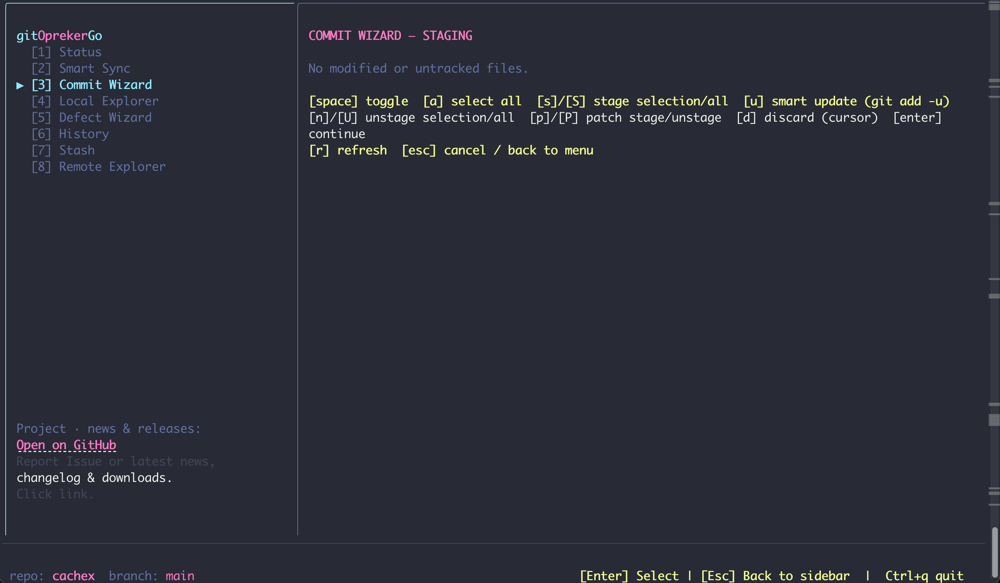
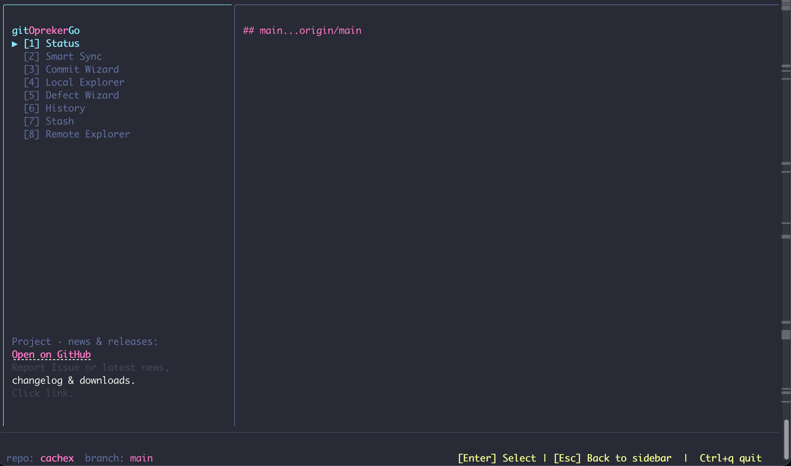
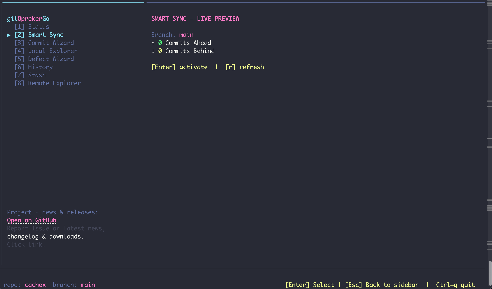
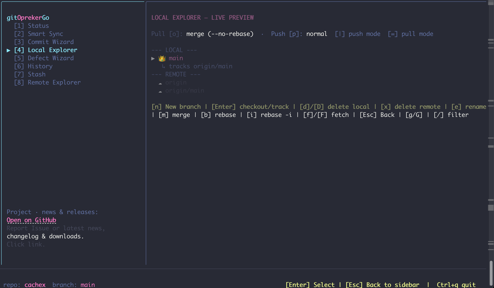

# gitOprekerGo
[](https://opensource.org/licenses/MIT)


Lightweight, blazing-fast TUI/CLI tool designed to supercharge your Git workflow

<div align="center">

# gitOprekerGo

⚡ Fast Git Automation TUI/CLI built with Go

Simple. Fast. Productive.

</div>

---

# 😩 Tired of Git Commands?

Ever found yourself typing this over and over again?

```bash
git add .
git commit -m "update"
git push origin main
```

Or forgetting things like:

- what branch you're on
- whether you've committed already
- where you're pushing
- long Git commands
- annoying typos
- complex workflows

Git is powerful, but sometimes the commands feel unnecessarily complicated.

---
<p align="center">
  
</p>

---

<p align="center">
  
</p>

---
<p align="center">
  
</p>

---

<p align="center">
  
</p>

---

# ✅ The Solution: gitOprekerGo

gitOprekerGo simplifies your daily Git workflow so you can focus on building, not memorizing commands.

Less typing.  
Less confusion.  
More productivity.

---

# ✨ Features

- 🚀 Simplified Git workflow
- ⚡ Fast native binary
- 🔥 Lightweight TUI/CLI
- 🛠 Built with Go
- 🌍 Cross-platform
  - macOS
  - Linux
  - Windows
- 📦 Automated Releases
- 💻 Developer-friendly

---
 
# 📥 Installation

## macOS / Linux

```bash
curl -fsSL https://raw.githubusercontent.com/OprekerSejati/gitOprekerGo/main/install.sh | bash
```

---

# 🚀 Usage

```bash
gitOprekerGo
```

---

# 📦 Manual Download

Download prebuilt binaries from:

👉 https://github.com/OprekerSejati/gitOprekerGo/releases

Available for:

- macOS Intel
- macOS Apple Silicon
- Linux AMD64
- Linux ARM64
- Windows

---

# 🛠 Built With

- Go
- GoReleaser
- GitHub Actions

---

# 🔄 Update

Reinstall using:

```bash
curl -fsSL https://raw.githubusercontent.com/OprekerSejati/gitOprekerGo/main/install.sh | bash
```

---

# 🗑 Uninstall

```bash
sudo rm /usr/local/bin/gitoprekergo
```

---

# 🤝 Contributing

Contributions, issues, and feature requests are welcome.

Feel free to open an issue or pull request.

---

# 📄 License

MIT License

---

<div align="center">

Made with ❤️ by OprekerSejati

</div>
